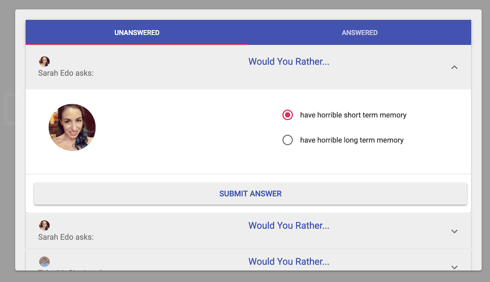

# Would You Rather

This project is an application that implements the popular game of decisions.
You are presented with a list of questions submitted by other users, and you must select one of the options presented.
You can also : 
        
* submit new question - you must format the questions with a clear option to choose
* view the result of each question
* see where you stand on the leader board

## Questions screen

# Limitations
* At present there is no functionality to register new users. 
* There is **no validation** on each question to determine its correctness - please be careful

# Background
This project is part of my React nanodegree from Udacity. It is constructed using a number of libraries and tools 
* React
* Redux - for state management
* PersistGate - for local storage
* Material-UI - UI components
* Reselect - for memoizing state selection
* immer -for immutability
* styled-components - for inline CSS styling
* lodash for object & array manipulation
* fontAwesome - icons 
  
  I have used this project to develop a standard set of tools to develop future React applications. There is a lot of experimentation that is a work in progress and will be refined as i develop future applications

This project was bootstrapped with [Create React App](https://github.com/facebook/create-react-app).
## Available Scripts

### Installation
To install the application , you can run:

### `npm install` or `yarn` from your terminal

please make sure you have compatible  
versions of npm or yarn as well as node

In the project directory, you can run:

### `npm start`

Runs the app in the development mode. 
Open [http://localhost:3000](http://localhost:3000) to view it in the browser.

The page will reload if you make edits. 
You will also see any lint errors in the console.

### `npm test`

Launches the test runner in the interactive watch mode. 
See the section about [running tests](https://facebook.github.io/create-react-app/docs/running-tests) for more information.

### `npm run build`

Builds the app for production to the `build` folder. 
It correctly bundles React in production mode and optimizes the build for the best performance.

The build is minified and the filenames include the hashes. 
Your app is ready to be deployed!

See the section about [deployment](https://facebook.github.io/create-react-app/docs/deployment) for more information.

### `npm run eject`

**Note: this is a one-way operation. Once you `eject`, you can’t go back!**

If you aren’t satisfied with the build tool and configuration choices, you can `eject` at any time. This command will remove the single build dependency from your project.

Instead, it will copy all the configuration files and the transitive dependencies (Webpack, Babel, ESLint, etc) right into your project so you have full control over them. All of the commands except `eject` will still work, but they will point to the copied scripts so you can tweak them. At this point you’re on your own.

You don’t have to ever use `eject`. The curated feature set is suitable for small and middle deployments, and you shouldn’t feel obligated to use this feature. However we understand that this tool wouldn’t be useful if you couldn’t customize it when you are ready for it.

## Learn More

You can learn more in the [Create React App documentation](https://facebook.github.io/create-react-app/docs/getting-started).

To learn React, check out the [React documentation](https://reactjs.org/).
# Would You Rather
